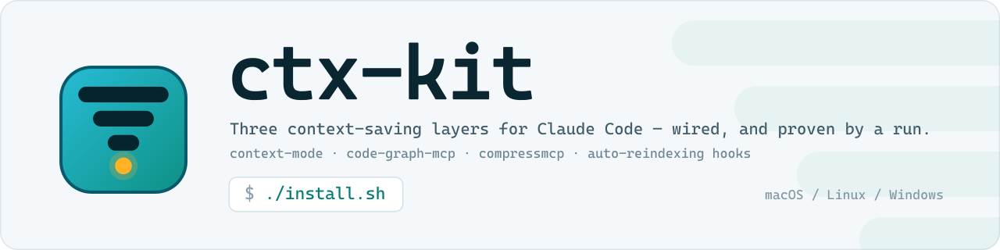

<p align="center">
  <picture>
    <source media="(prefers-color-scheme: dark)" srcset="assets/hero-dark.svg">
    
  </picture>
</p>

<p align="center">
  <a href="LICENSE"></a>
  
  
</p>

**One command wires Claude Code's three context-saving layers into a repo — plus the
automatic reindexing none of them ship with — and then proves each one with a run.**

The proof is the point. All three layers fail *silently*: a hook that exits 127 reports
nothing to the UI, an MCP server that cannot spawn simply never appears, and
`semantic_code_search` degrades into keyword search while still returning plausible-looking
results. If you drive Claude Code on a repo large enough that the context window is the
bottleneck, this is the wiring you would otherwise get wrong by hand — on Unix and on
Windows alike.

```bash
git clone https://github.com/vibegameengine/ctx-kit
./ctx-kit/install.sh --project-dir /path/to/your/repo
```

Or from inside the repo you want to configure:

```bash
./install.sh          # configure the current git repo
./verify.sh           # prove every layer actually works
./uninstall.sh        # roll back
```

On Windows, same thing with the PowerShell scripts — see [Windows](#windows):

```powershell
.\install.ps1
.\verify.ps1
.\uninstall.ps1
```

The kit itself can live anywhere. All it puts in the target repo is
`.claude/settings.local.json` plus two `.gitignore` lines.

If an **agent** is doing the install, point it at [AGENTS.md](AGENTS.md) — the runbook
for exactly that: the order of operations, the three paths it will touch outside the
repo, the one step it cannot do for you, and the failures it would otherwise report as
successes.

## What it sets up

| Layer | What it does |
|---|---|
| **context-mode** (plugin) | Runs commands in a sandbox and indexes big outputs into SQLite FTS5, so logs, snapshots and API payloads never enter the context window. |
| **code-graph-mcp** (plugin) | Tree-sitter AST graph of the repo in SQLite. Answers "who calls X / what breaks if I change X" by reading the blast radius instead of the tree. |
| **compressmcp** (npm) | Losslessly compresses MCP tool responses via key abbreviation before they hit the context. |
| **project hooks** (this kit) | Keeps the graph fresh automatically — the part you otherwise wire by hand. |

## The reindexing problem this kit solves

`code-graph-mcp` does **not** keep its index current on its own. Its `PostToolUse Write|Edit`
hook ships **default-off** since v0.21 — the plugin relies on query-time freshness
(`ensure_file_indexed`) inside MCP tools that take a `file_path`, so a brand-new file nobody
asked about by path never shows up in search.

The kit closes all three gaps:

| Source of change | Covered by |
|---|---|
| Agent `Write` / `Edit` | `env CODE_GRAPH_HOOK_INDEX=on` → re-enables the plugin's own hook |
| Your edits in the editor, `git pull`, asset generators, branch switches | `SessionStart` hook |
| Edits outside the agent, mid-session | `UserPromptSubmit` hook, throttled (default 120s) |

Both hooks are `async: true`, so nothing blocks the prompt.

## The gotcha this kit exists to encode

Hook commands run in a shell that does **not** have your Node version manager's bin
directory on `PATH`. Every npm-global CLI here (`code-graph-mcp`, `compressmcp`) is a
`#!/usr/bin/env node` shim, so an absolute path is **not enough** either — the shebang
cannot find `node` and the hook dies with `exit 127`.

A hook that exits 127 fails **invisibly**. Nothing in the UI reports it. The graph just
quietly stops updating.

Every generated hook therefore resolves the binary across the common version-manager
layouts *and* puts its directory on `PATH`:

```sh
CG=$(command -v code-graph-mcp 2>/dev/null)
[ -x "$CG" ] || CG=$(ls -t "$HOME"/.nvm/versions/node/*/bin/code-graph-mcp ... | head -1)
[ -x "$CG" ] || exit 0
export PATH="$(dirname "$CG"):$PATH"
```

`verify.sh` tests this the only way that proves anything: it pulls the command **out of
the settings file** and runs it under `env -i`. Testing in a normal shell passes
misleadingly, because your interactive profile has already loaded nvm.

## Other lessons baked in

- **Project-local, not global.** Hooks go in `.claude/settings.local.json`, not
  `~/.claude/settings.json` — global hooks would fire `incremental-index` in every repo you
  open, including ones with no graph.
- **`exit 0` always.** A non-zero `UserPromptSubmit` hook blocks the prompt.
- **Never re-run `compressmcp install` once it is wired.** Its installer overwrites
  `settings.json → statusLine`. If code-graph is also installed, its composite status line
  has already adopted compressmcp's as `_previous`; re-running replaces the composite and
  silently drops code-graph's segment. `install.sh` detects this and skips.
- **`compressmcp check` lies about the status line** in exactly that situation. `verify.sh`
  cross-checks `~/.claude/statusline-providers.json` before reporting it.
- **Merge, never clobber.** `lib/settings.mjs` refuses to touch malformed JSON — overwriting
  it would silently disable every setting already in the file — and strips its own previous
  hooks before re-adding, so re-running never stacks duplicates.
- **`.gitignore` matters.** `settings.local.json` holds absolute machine paths and
  `.code-graph/` is a multi-megabyte local DB. Both get added.
- **The embedding model never downloads itself.** See below — this one is worth its own
  section.

## Vector search does not work out of the box

`semantic_code_search` sounds like it does semantic matching. Until the embedding model is
installed it is plain FTS5/BM25 keyword search — and it still returns plausible-looking
results, so the degradation is easy to miss. `code-graph-mcp doctor` is the tell:

```
Embeddings  ⚠️  vector INACTIVE — 5198 embeddable nodes, 0 embedded
                (model not loaded and NO download has ever been attempted on this machine)
```

The weights are supposed to download "lazily on first use". In practice that can never
fire at all, and no amount of querying triggers it. `./install-model.sh` installs them
deterministically — ~80 MB, checksum-verified, from the GitHub release matching your
binary version.

Three traps it routes around, each of which silently produces "installed but still not
working":

1. **Hand-filling the default cache dir does not work.** `<cache>/code-graph/models` is
   only trusted once the binary's own `extract_and_promote` has written a `.model-id`
   marker; a manually populated copy is treated as not-current and ignored. The supported
   route is a *separate* directory pointed at by `CODE_GRAPH_MODEL_DIR`.
2. **The published `.sha256` is a bare hash with no filename**, so `shasum -c` fails with
   `no properly formatted SHA checksum lines found`. It has to be compared by hand.
3. **Loading the model is not using it.** The server logs `Embedding model loaded
   successfully` while coverage sits at 0% — embeddings are only generated during an index
   pass, so the script runs one. It is resumable: re-run to finish.

`CODE_GRAPH_MODEL_DIR` is written to `~/.claude/settings.json` (machine-wide, since the
model is machine-wide and the MCP server inherits its environment from Claude Code).
**Restart Claude Code afterwards** — until then the CLI has the model but the running
server does not.

## Windows

`install.ps1` / `verify.ps1` / `uninstall.ps1` / `install-model.ps1` are the Windows
counterparts, and they are not a translation for its own sake — every failure below is
one the POSIX scripts cannot see, and each of them fails *silently*.

Both platforms generate their hooks from the same `lib/settings.mjs`, so the two can
never drift apart. Windows PowerShell 5.1 is enough; nothing needs installing.

**The hook is PowerShell, and pinned.** Claude Code runs a Windows hook through Git Bash
*when Git for Windows is present*, and falls back to PowerShell when it is not. A
bash-only hook is therefore silently dead on a machine without Git Bash. Every generated
Windows hook carries `"shell": "powershell"` so which shells happen to be installed stops
mattering.

**The exe is not on PATH — anywhere.** On macOS/Linux the trap is a `#!/usr/bin/env node`
shim whose shebang cannot find node (`exit 127`). On Windows that trap does not exist:
`code-graph-mcp.exe` is native and needs nothing on PATH once its path is known. The
Windows trap is the mirror image — the plugin *downloads* that exe into `~\.cache\code-graph\bin`
and installs no npm shim at all, so `Get-Command code-graph-mcp` finds nothing on a machine
where the tool is present and working. The hooks resolve it by path (cache file first);
`install.ps1` triggers the download itself instead of printing "restart Claude Code and
re-run".

**compressmcp's MCP registration cannot start on Windows.** Its installer writes
`{"command": "compressmcp", "args": ["--server"]}`, which Claude Code spawns in exec form —
no shell. On Windows the extensionless npm shim is not an executable (`ENOENT`), and the
`.cmd` shim is refused by Node >= 18.20, which will not spawn `.cmd`/`.bat` without a shell
(`EINVAL`). The server never starts and nothing reports it. `install.ps1` rewrites the entry
to `node <entry> --server`; `verify.ps1` fails if it finds anything else.

**`env -i` does not translate.** Clearing a child's environment block on Windows makes
`CreateProcess` fail for every native exe the command runs — with no output, no exit code
and no error. A probe written that way passes while proving nothing. `verify.ps1` keeps the
block and strips *PATH* instead, down to the system minimum: that is what actually catches a
hook which only worked because your shell had node / npm / Git Bash on it.

**Three PowerShell traps the scripts encode, because each one looks correct:**

- The `.ps1` files are **pure ASCII on purpose.** Windows PowerShell 5.1 reads a BOM-less
  script as the ANSI code page, where a UTF-8 `✓` (and an em dash) decodes to bytes
  including `0x93` — a smart quote, which PowerShell accepts as a *string delimiter*. One
  tick inside a comment makes the whole script fail to parse.
- `-like '*[ctx-kit]*'` is not a substring match. `[]` is a wildcard character class, so the
  kit's own marker throws "not a valid wildcard pattern".
- `$ErrorActionPreference = 'Stop'` plus a native command that writes to stderr is a killed
  script: 5.1 wraps stderr lines in a `NativeCommandError` even when the exe exited 0, and
  `code-graph-mcp` writes progress notes to stderr on nearly every call.

**`git check-ignore` answers differently per shell.** Git's global excludes file resolves
through `$HOME`, which Git Bash exports and PowerShell does not — so the same repo reports
a path as ignored from bash and not ignored from PowerShell. `verify.ps1` asks the way Git
Bash would, instead of reporting a false failure.

**Line endings.** `.gitattributes` pins `*.sh` to LF. A Windows clone defaults to
`core.autocrlf=true`; Git for Windows' own bash tolerates the stray `\r`, but the same
checkout read from WSL or a Linux container dies on line 1 with `$'\r': command not found`.

```powershell
.\install.ps1 -ProjectDir C:\src\repo -Throttle 300 -Yes
.\install-model.ps1 -NoEmbed
.\verify.ps1 -NoProbe
.\uninstall.ps1 -Global -PurgeIndex
```

## After installing

Claude Code only watches directories that already had a settings file when the session
started. A freshly created `.claude/settings.local.json` is not picked up until the config
reloads:

> **Open `/hooks` once, or restart Claude Code.**

Then `./verify.sh` should report the hooks firing.

## Options

```
./install.sh --project-dir DIR    # default: git root of $PWD
             --throttle SEC       # min gap between mid-session reindexes (default 120)
             --skip-plugins       # if the plugins are managed elsewhere
             --skip-compressmcp   # pointless if you have no MCP servers
             --no-index           # skip the initial graph build
             -y                   # no prompts

./install-model.sh --project-dir DIR   # embedding model for real vector search (~80 MB)
                   --model-dir DIR     # where to put the weights
                   --no-embed          # install weights but skip the indexing pass

./verify.sh  --no-probe           # skip the write/index/delete round trip

./uninstall.sh --global           # also unwire compressmcp + plugins
               --purge-index      # also delete .code-graph/ (confirms first)
```

The PowerShell scripts take the same options as native parameters:

```
.\install.ps1       -ProjectDir DIR  -Throttle SEC  -SkipPlugins  -SkipCompressMcp
                    -NoIndex  -Yes
.\install-model.ps1 -ProjectDir DIR  -ModelDir DIR  -NoEmbed
.\verify.ps1        -ProjectDir DIR  -NoProbe
.\uninstall.ps1     -ProjectDir DIR  -Global  -PurgeIndex  -Yes
```

## Layout

```
install.sh          orchestrates, idempotent, self-verifying
install-model.sh    embedding model for vector search; separate because it is ~80 MB
verify.sh           evidence-based checks; exits non-zero on failure
uninstall.sh        rollback; never deletes without an explicit flag
lib/common.sh       CLI resolution, bare-env runner, logging

install.ps1         the same four, for Windows / PowerShell 5.1
install-model.ps1
verify.ps1
uninstall.ps1
lib/common.ps1      CLI resolution, stripped-PATH runner, logging

AGENTS.md           install runbook for an agent doing this on someone's behalf
assets/             logo + hero banners (light and dark), self-contained SVG

lib/settings.mjs    merges/removes hooks in .claude/settings.local.json; emits the sh
                    or the PowerShell flavour, so both platforms share one source
lib/global-env.mjs  merges one key into ~/.claude/settings.json env
lib/mcp-entry.mjs   repoints an MCP registration at `node <entry>` (exec-form safe)
```

## Requirements

Node 18+, the `claude` CLI, git.

macOS and Linux use the `.sh` scripts; Windows uses the `.ps1` ones and needs nothing
beyond Windows PowerShell 5.1, which every Windows install already has.
